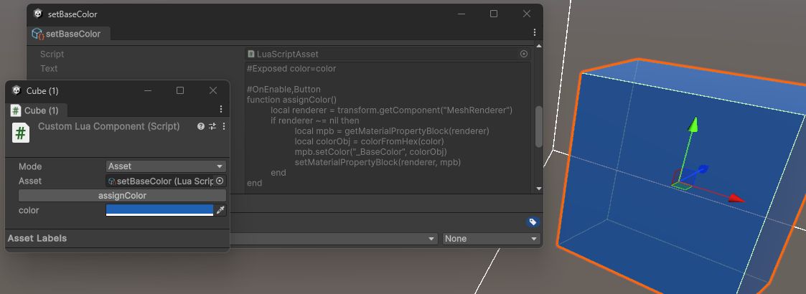

# LuaScript
### Dependencies
- Includes [moonsharp](https://github.com/moonsharp-devs/moonsharp) for Unity
- Depends on `com.unity.nuget.newtonsoft-json` package at least version 1.0.0

## LuaScript
The object that contains NLua's `Lua` state object, also provides these:
- `TryGetFunction(name)` to get a function with the given name if it exists
- `TryCall(name)` to try and call a function that may or may not exist
- `GetObject(name)` to get a variable from Lua's global table in this script
- `SetObject(name, value)` to add a value to the global table
- `RegisterFunction(name, method)` to add a function to this script
- `CallWithTag(tag)` to call all functions with this tag
- `Dispose()` to dispose the `Lua` state object, usually in Unity's disable event

Example:
```cs
int a = 1;
int b = 4;
string sourceCode = "function abacus(a, b) return mutate(a, b) end";
LuaScript newScript = new LuaScript("scriptName", sourceCode);
RegisterFunctions(newScript);
Debug.Log(newScript.Call("abacus", a, b)); //advanced 1+1

public static void RegisterFunctions(LuaScript script)
{
    script.RegisterFunction("mutate", typeof(MyClass).GetMethod(nameof(Mutate)));
}

public static int Mutate(int a, int b) 
{
    return a + b;
}
```

## LuaComponent


- A basic component that will call functions with these tags:
  - Awake
  - Start
  - OnEnable
  - OnDisable
  - no Update or FixedUpdate
- will have `transform` and `gameObject` accessible from scripts
- will automatically reload itself when its asset changes in editor or literal text changes in both editor and build

To add extra functionality, inherit from `LuaComponent` and override `OnCreated()` to insert functions from C# with name and `MethodInfo` parameters:
```cs
public class CustomLuaComponent : LuaComponent
{
    protected override void OnCreated()
    {
        BindingFlags flags = BindingFlags.NonPublic | BindingFlags.Instance;
        MethodInfo method = typeof(MyClass).GetMethod(nameof(Print), flags);
        script.AddFunction("print", Print);
    }

    private void Print(object? message)
    {
        Debug.Log(message, this);
    }
}
```
```lua
function start()
    print("hello " .. "world")
end
```

## Tags
Tags are an added feature available when scripting and to help setup custom APIs
1. Using tags on functions:
    ```lua
    #UpdateEvent
    function thisWillBeCalledEveryFrame()
        -- do something
    end
    ```
    Good for abstracting away from the function name
    ```cs
    TextAsset asset = Resources.Load<TextAsset>("MyScript");
    LuaScript script = new(asset.name, asset.text);
    script.CallWithTag("UpdateEvent");
    ```
2. Using tags at the top to attach tags to the script itself:
    ```lua
    #IsStaticSystem
    #Tags=CouldBe:AnyFormat()

    #GameStarted
    function start()
        print("game has begun")
    end
    ```
    Can be used to categorize loaded scripts at runtime
    ```cs
    LuaScript script = ...
    if (script.Tags.Contains("IsStaticSystem"))
    {
        Game.AddStaticSystem(script);
    }
    else if (script.Tags.Contains("AttachToPlayer"))
    {
        scriptsToGivePlayers.Add(script);
    }
    ```

## Sample
The included sample has a `CustomLuaComponent` to show how the included LuaComponent can be extended, in this case to implemented a new feature for exposing values to the inspector like so:
```lua
#Exposed color=playerColor
#Exposed decimal=playerSpeed
#Exposed integer=playerHealth

#Awake
function loadColor()
    --do something here
end
```

Types that are supported for this component
* color
* decimal
* integer
* boolean
* text
* vector2
* vector3
* asset